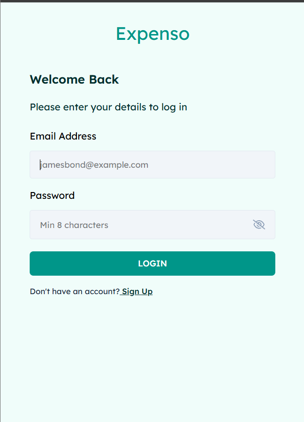
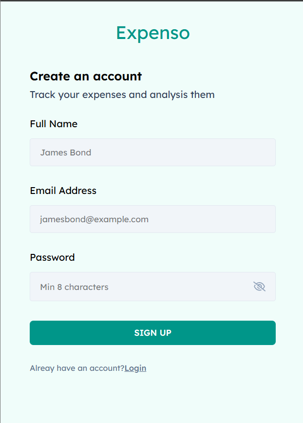
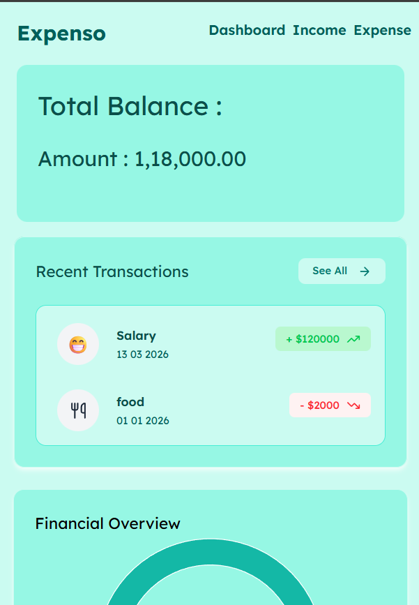
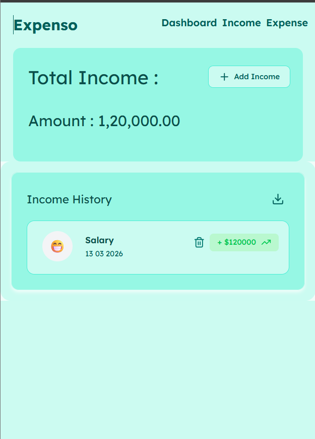

Expenso: What Gets Tracked, Gets Managed

Expenso is a straightforward expense tracker built to help you keep an eye on your money. It uses the MERN stack to help users log their daily finances, see where their money goes through charts, and keep their data private and secure.

How It’s Built

Frontend: React.js for the interface and Tailwind CSS for a clean, simple design.

Backend: Node.js and Express to handle the logic and API.

Database: MongoDB to store all your income and expense records.

Security: JWT for user login sessions and Bcrypt to keep passwords safe.

🌟 Features

🔐 Secure Login & Signup
User Accounts: Create an account and log in securely.

Privacy: Your financial data is protected and only accessible after you log in.

📊 Dashboard

Summary: See your total balance, total income, and total expenses in one place.

Visual Charts: Simple graphs that show you the balance between your earnings and spending.

History: A list of your most recent transactions so you can quickly see what’s happened lately.

💰 Incomes & Expenses

Separate Pages: Dedicated sections to manage your money coming in and money going out.

Emoji Picker: Add emojis to your transactions (like 🍔 for food or 💰 for salary) to make them easy to identify.

Full Control: You can easily add new items or delete old ones, and the totals will update automatically.

🛠️ Tech Stack

Frontend: React, Tailwind CSS

Backend: Node.js, Express

Database: MongoDB

Security: JWT, Bcrypt

UI Elements: Emoji Picker, Lucide Icons

| Login | Signup |
|----------------|-----------|
|  |  |

| Dashboard | Income |
|--------------|--------------|
|  |  |
